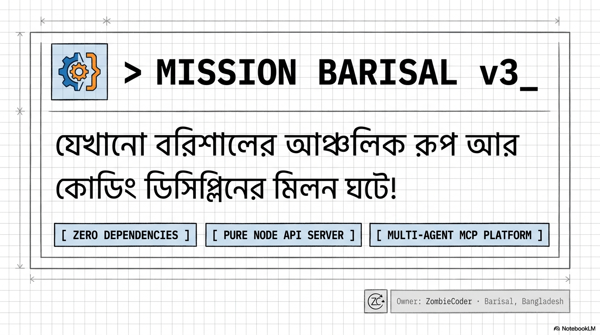
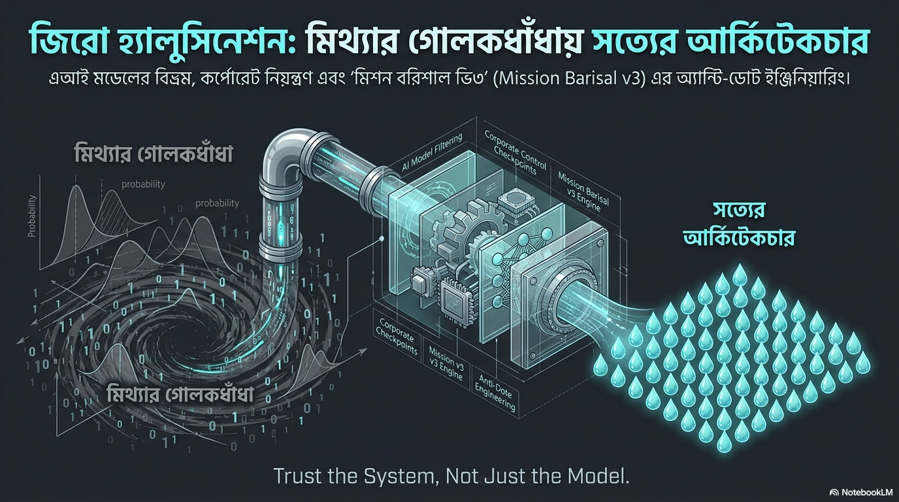
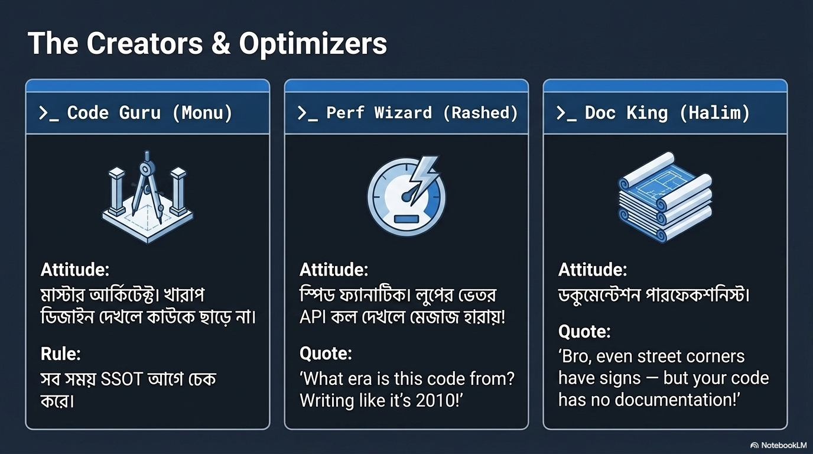
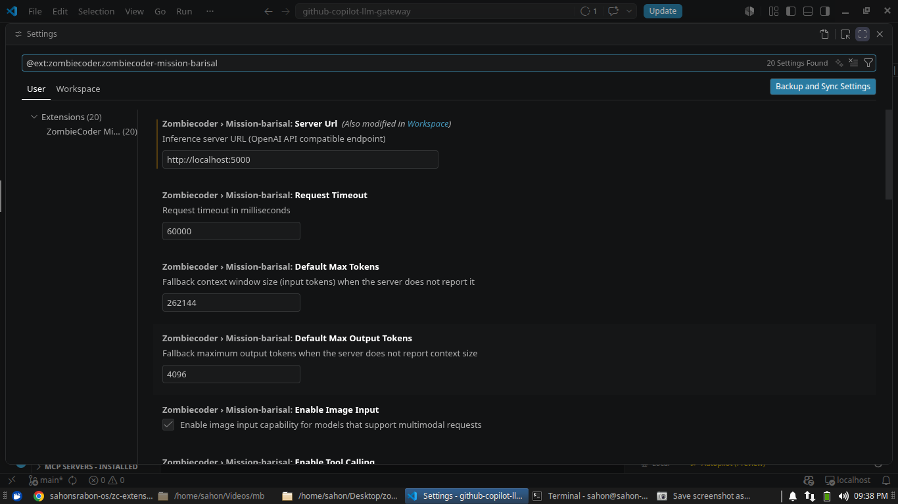
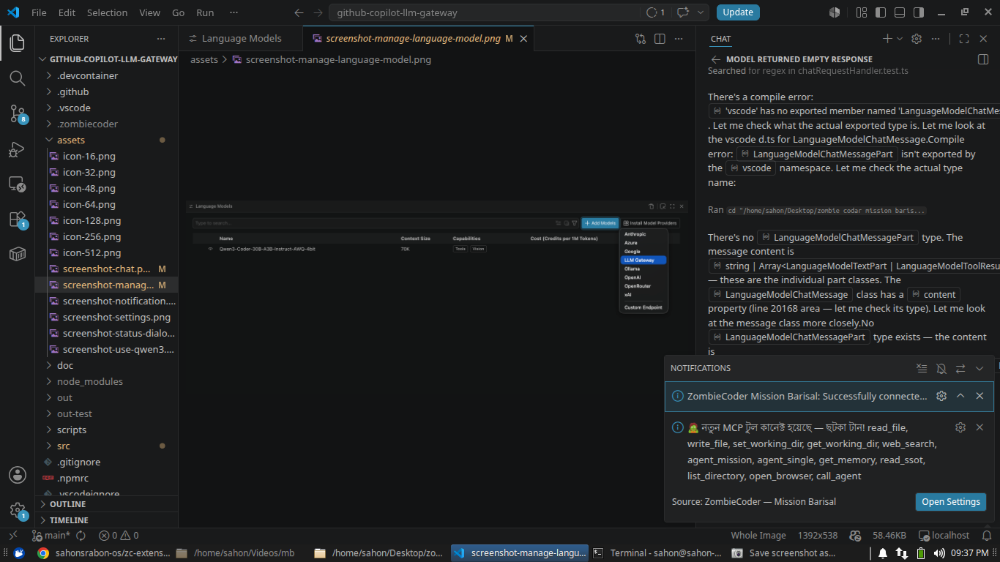
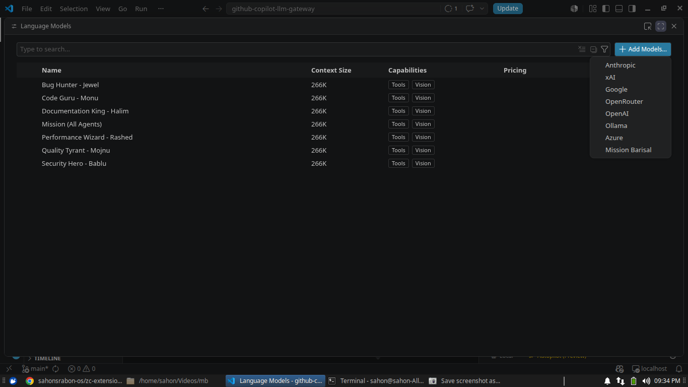
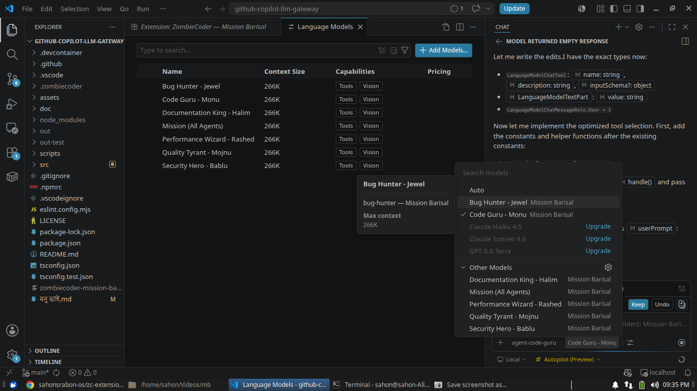
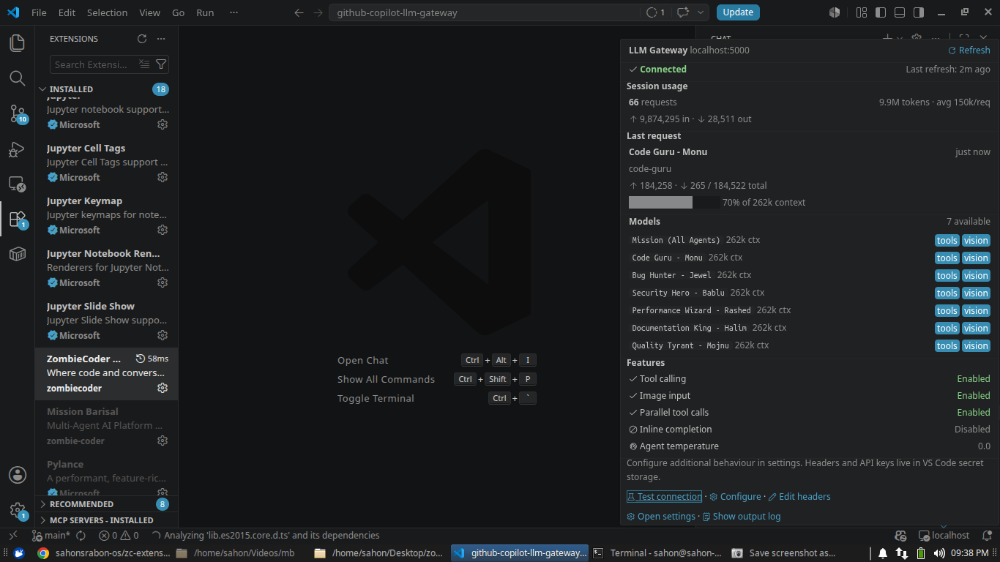

# 🧟 ZombieCoder — Mission Barisal


> **Where code and conversation meet** — connect GitHub Copilot Chat to your own local
> 7-agent LLM server over HTTP / SSE / WebSocket / **UDS (Unix Domain Socket)** with
> tool-call repair, safe context budgeting and real-time streaming.

**ZombieCoder — Mission Barisal** registers as a language model provider inside GitHub
Copilot Chat and routes every prompt to **your** inference server — vLLM, Ollama,
llama.cpp, LM Studio, LocalAI, or the Mission Barisal 7-agent gateway. It is the
client half of the **Mission Barisal** platform: a robustness layer that repairs the
rough edges small, quantized and fine-tuned models produce, and hands clean,
evidence-first context to the server's agents.

Built by **Sahon Srabon** · **Developer Zone** · Dhaka, Bangladesh
[zombiecoder.my.id](https://zombiecoder.my.id/) · infi@zombiecoder.my.id



---

## System Architecture

Mission Barisal is an **evidence-driven, multi-agent architecture**: six specialized
Bengali agents (plus a combined mission agent) collaborate through a type-safe,
proof-first pipeline. The extension is the client half — it repairs model rough
edges, injects SSOT/syllabus/session context, and routes every prompt over the best
available transport (UDS → HTTP → SSE → WebSocket).


### The 7 Mission Barisal Agents

Each agent has a unique Bengali persona, an architecture role, and a strict
**evidence gate** — every claim must be proven with file references, test output or
line numbers before it reaches the user.

| ID            | Persona                   | Role          | Expertise                                        |
| ------------- | ------------------------- | ------------- | ------------------------------------------------ |
| `mission`     | All Agents (combined)     | Mission       | 3-phase debate: initial → cross-verify → output  |
| `code-guru`   | কোড গুরু - মনু            | Architecture  | System design, patterns, clean code              |
| `bug-hunter`  | বাগ হান্টার - জুয়েল       | Debugging     | Bug detection, error analysis, root cause        |
| `security-hero` | সিকিউরিটি হিরো - বাবলু  | Security      | Security audit, OWASP, vulnerability assessment  |
| `perf-wizard` | পারফরম্যান্স উইজার্ড - রাশেদ | Performance | Optimization, caching, resource management       |
| `doc-king`    | ডকুমেন্টেশন রাজা - হালিম  | Documentation | API docs, README, technical writing              |
| `qa-tyrant`   | কোয়ালিটি তস্কর - মজনু    | Quality       | Testing, QA, code quality, release readiness     |

### Zero-Hallucination Engineering

The platform is built on **evidence-first principles** — "First Evidence, Then
Conclusion. First Truth, Then Confidence." The Evidence Gate blocks unproven claims,
the Prompt Sanitizer strips middleman boilerplate, and the Compiler Check verifies
code before it is shown.



---

## Why ZombieCoder?

A plain OpenAI-compatible connection trusts your endpoint as-is and does no
quirk-smoothing. Mission Barisal actively repairs the rough edges:

| Capability                          | What it solves                                                                                                                                                                                    |
| ----------------------------------- | ------------------------------------------------------------------------------------------------------------------------------------------------------------------------------------------------ |
| **Tool-call JSON repair**           | Recovers truncated / malformed tool-call arguments (unclosed strings or braces, trailing commas) and fills in missing _required_ arguments from the tool schema so the call still runs.           |
| **Streaming tool-call assembly**    | Reassembles tool calls from incremental stream deltas across multiple wire formats, tolerating late or missing call IDs.                                                                          |
| **Reasoning / thinking handling**   | Routes `<think>`/`<thinking>` blocks and `reasoning_content` into Copilot's thinking UI instead of dumping chain-of-thought into chat — even when tags split across stream chunks.                 |
| **Safe context budgeting**          | Auto-detects the real context window from `/v1/models` (vLLM, LiteLLM, Ollama, llama.cpp, LocalAI field names) and shrinks `max_tokens` so small servers don't return context-length errors.      |
| **Tool-call tuning**                | Low agent temperature plus parallel-tool-call / tool-choice toggles stabilize tool-call formatting from finicky fine-tuned models.                                                               |
| **Actionable diagnostics**          | Turns connection / auth / timeout / parser failures into concrete fixes (remove a stray `/v1`, drop a `Bearer ` prefix, raise the timeout, disable tool calling).                                 |
| **Empty-response retry**            | When a model returns nothing under 70+ tools, the request is transparently retried **once without tools** so you still get an answer instead of an empty chat.                                    |
| **Evidence-first answers**          | Conversational answers always flow; only unsupported claims ("I fixed X") are flagged — never your real response.                                                                                 |

### Mission Barisal platform features

| Feature                          | What it does                                                                                                                  |
| -------------------------------- | ----------------------------------------------------------------------------------------------------------------------------- |
| **SSOT + Syllabus + Session Memory** | The extension reads `.zombiecoder/SSOT.md`, the agent syllabus and per-workspace session memory, and prepends them to every request as a clean system message. |
| **Prompt sanitizer (dālāli stripper)** | Detects and strips the VS Code middleman system prompt so agents only ever see the user's real intent.                         |
| **UDS-first JSON-RPC transport** | Probes `/tmp/zombiecoder/mcp.sock` with a real JSON-RPC `tools/list` round-trip on local servers, then falls back to HTTP → SSE → WebSocket. Chat, MCP tools and missions all run over the socket — not just HTTP. |
| **Optimized tool selection**     | Scores Copilot's catalog (~71 tools) against the user's latest message and sends only the relevant 8–40 tools — fixing empty responses on small/quantized servers. |
| **URL normalization**            | Works whether you paste `http://host:port` **or** `http://host:port/v1` — trailing `/v1` is trimmed and re-appended correctly. |
| **External MCP tool sync**       | Merges your server's `/mcp tools/list` (plus an optional external MCP server) into every agent's system context.               |
| **Ollama model discovery**        | Reads the backend's own sampler config (`/api/show`) and forwards `top_p`/`top_k` instead of letting the server default them.  |

### The Honest Blueprint

Mission Barisal is built around a simple contract: **no fabricated work, no invented
progress**. The blueprint below is the design document the platform ships with —
every feature in this README traces back to one of its principles.


### Transport & Socket Architecture

```
┌────────────────────────────────────────────────────────────────────┐
│                     GITHUB COPILOT CHAT                           │
│            (VS Code Language Model Provider API)                  │
└───────────────────────────┬────────────────────────────────────────┘
                            │
                            ▼
┌────────────────────────────────────────────────────────────────────┐
│              ZOMBIECODER MISSION BARISAL EXTENSION                │
│                                                                   │
│   Prompt Sanitizer  →  Context Builder  →  Tool Selection (≤40)   │
│   Evidence Gate  →  Token Budget  →  Transport Resolver           │
└───────────────────────────┬────────────────────────────────────────┘
                            │
              ┌─────────────┼──────────────┬──────────────┐
              ▼             ▼              ▼              ▼
         ┌─────────┐   ┌─────────┐    ┌─────────┐    ┌──────────┐
         │   UDS   │   │  HTTP   │    │   SSE   │    │  WS      │
         │ (socket)│   │         │    │         │    │          │
         └────┬────┘   └────┬────┘    └────┬────┘    └────┬─────┘
              └─────────────┼──────────────┼──────────────┘
                            ▼
              ┌──────────────────────────────┐
              │   MISSION BARISAL SERVER     │
              │  7 agents · MCP · evidence   │
              │  anti-dote · 3-phase debate  │
              └──────────────────────────────┘
```

Local server URLs probe the **UDS socket first** (`/tmp/zombiecoder/mcp.sock`), then
fall back to HTTP → SSE → WebSocket. The socket speaks newline-delimited JSON-RPC —
chat, MCP tools and mission runs all work over it. For the server-side blueprint of
the same architecture, see the [Mission Barisal V3 Blueprint](assets/mission-architecture-slide.png).



### Compatible Inference Servers

- [vLLM](https://github.com/vllm-project/vllm) — high-performance inference (recommended)
- [Ollama](https://ollama.ai/) — easy local deployment
- [llama.cpp](https://github.com/ggml-org/llama.cpp) — CPU and GPU inference
- [Text Generation Inference](https://github.com/huggingface/text-generation-inference)
- [LocalAI](https://localai.io/) — OpenAI API drop-in
- [LiteLLM](https://github.com/BerriAI/litellm) — proxy to 100+ providers
- Any OpenAI Chat Completions-compatible endpoint, including the **Mission Barisal 7-agent server**

---

## Test Commands

### Local Server (`http://localhost:9999`)

#### Health Check

```bash
curl http://localhost:9999/health
```

#### List All Agents (OpenAI format)

```bash
curl http://localhost:9999/v1/models
```

#### Chat with code-guru (Architecture)

```bash
curl -X POST http://localhost:9999/v1/chat/completions \
  -H "Content-Type: application/json" \
  -d '{
    "model": "code-guru",
    "messages": [{"role": "user", "content": "একটা Express.js সার্ভারের ফোল্ডার স্ট্রাকচার দাও।"}],
    "stream": false
  }'
```

#### Mission Mode (Full 6-Agent Debate)

```bash
curl -X POST http://localhost:9999/v1/chat/completions \
  -H "Content-Type: application/json" \
  -d '{
    "model": "mission",
    "messages": [{"role": "user", "content": "একটা ই-কমার্স সাইটের API ডিজাইন করো — সিকিউর, ফাস্ট, এবং স্কেলেবল।"}],
    "stream": false
  }'
```

#### UDS Socket (JSON-RPC `tools/list`)

```bash
printf '{"jsonrpc":"2.0","id":1,"method":"tools/list","params":{}}\n' \
  | nc -U /tmp/zombiecoder/mcp.sock
```

#### UDS Chat (Mission Barisal message protocol)

```bash
# Send {type:'chat'} over the socket — streamed JSON events come back
node -e '
const net = require("net");
const sock = net.createConnection({ path: "/tmp/zombiecoder/mcp.sock" });
let buffer = "";
sock.on("connect", () => sock.write(JSON.stringify({
  type: "chat",
  session_id: "test",
  agent_id: "code-guru",
  messages: [{ role: "user", content: "Say hi" }],
  params: { stream: true }
}) + "\n"));
sock.on("data", (d) => { buffer += d; let i;
  while ((i = buffer.indexOf("\n")) !== -1) {
    const line = buffer.slice(0, i).trim(); buffer = buffer.slice(i + 1);
    if (!line) continue;
    const evt = JSON.parse(line);
    if (evt.type === "response_done") { console.log(evt.data.content); process.exit(0); }
  }
});'
```

### Extension Test Suite

```bash
# TypeScript compile check
npx tsc -p ./ --noEmit

# Full test suite (496 tests — build + run)
npm test
```

---

## Getting Started

### Prerequisites

- **VS Code** 1.120.0 or later
- **GitHub Copilot** extension installed and signed in
- **Inference server** running with an OpenAI-compatible API (or the Mission Barisal server)

### Step 1: Install the Extension

**From a `.vsix` file** (recommended for this release):

1. Download `zombiecoder-mission-barisal-1.7.0.vsix`
2. In VS Code open the Command Palette (`Ctrl+Shift+P` / `Cmd+Shift+P`)
3. Run **Extensions: Install from VSIX...** and select the file
4. Reload VS Code when prompted

**From the Marketplace** (when published): search **"ZombieCoder Mission Barisal"** and click Install.

### Step 2: Start Your Inference Server

Launch your server with tool calling enabled. Example using vLLM:

```bash
vllm serve Qwen/Qwen3-8B \
    --enable-auto-tool-choice \
    --tool-call-parser hermes \
    --max-model-len 32768 \
    --gpu-memory-utilization 0.95 \
    --host 0.0.0.0 \
    --port 42069
```

Verify it's running:

```bash
curl http://localhost:42069/v1/models
```

Or run the **Mission Barisal 7-agent server** (`start-all.sh`) — it serves
`/v1/chat/completions`, `/mcp` tool lists, and UDS sockets in `/tmp` automatically.

### Step 3: Configure the Extension

1. Open VS Code **Settings** (`Ctrl+,` / `Cmd+,`)
2. Search for **"Mission Barisal"**
3. Set **Server URL** to your server address — `http://localhost:9999` (default) or
   `http://localhost:42069`. Adding `/v1` is optional; it is normalized automatically.
4. Configure token limits, tool calling and other options as needed.



> Server unreachable? You'll get an error notification with a quick link to settings:
> 

### Step 4: Select Your Model in Copilot Chat

1. Open **GitHub Copilot Chat** (`Ctrl+Alt+I` / `Cmd+Alt+I`)
2. Click the **model selector** dropdown at the bottom of the chat panel
3. Click **"Manage Models..."** to open the model manager
4. Select **"Mission Barisal"** from the provider list
5. Enable the models you want (or use the **"ZombieCoder Mission Barisal: Configure Server"** command first)



### Step 5: Start Chatting

Your local models now appear alongside the default Copilot models. Select one and start
coding with AI assistance!



Works with:
- **Agent mode** for autonomous coding tasks
- **Tool calling** for file operations, terminal commands, and more
- **Context awareness** with `@workspace` and file references

### Status Bar & Connection Info

A status-bar entry (bottom-right) shows the connection state at a glance and becomes a
live indicator while a request streams. Hover it for a detailed popup — connection
status, detected models with context windows and capabilities, session token totals,
the last request and the active feature toggles. Click it to refresh the model list.



### Using your models in the Agents window (Preview)

VS Code 1.120+ adds the **Agents window** — a separate window for running multiple agent
sessions in parallel. It shares the same model registry as Chat, so Mission Barisal
models can be selected there too.

Extensions that execute code don't auto-activate in the Agents window — opt this
extension in with the `extensions.supportAgentsWindow` setting:

```jsonc
"extensions.supportAgentsWindow": {
  "zombiecoder.zombiecoder-mission-barisal": true
}
```

Requirements and notes:

1. The extension must be installed in your **default VS Code profile**.
2. After adding the setting, reload/reopen the Agents window so the extension activates.
3. Your models then appear in the per-session **language model** picker, with the same
   tool-calling and image capabilities they have in Copilot Chat.

> Agents-window support is a VS Code preview and is evolving. If a model doesn't appear
> after opting in, confirm the extension is enabled in your default profile and check the
> **"ZombieCoder Mission Barisal"** output channel.

---

## Configuration

Configure through VS Code Settings (`Ctrl+,` / `Cmd+,`) → search **"Mission Barisal"**.

### Connection Settings

| Setting             | Default                 | Description                                                    |
| ------------------- | ----------------------- | -------------------------------------------------------------- |
| **Server URL**      | `http://localhost:9999` | Base URL of your OpenAI-compatible inference server (`/v1` optional) |
| **API Key**         | _(empty)_               | Authentication key if your server requires one                 |
| **Request Timeout** | `60000`                 | Request timeout in milliseconds                                |
| **External MCP Server URL** | _(empty)_         | Optional external MCP server; when set its tool list is merged into agent context |

### Model Settings

| Setting                       | Default  | Description                                                                                                  |
| ----------------------------- | -------- | ------------------------------------------------------------------------------------------------------------ |
| **Default Max Tokens**        | `262144` | Fallback context window size (input tokens) used only when the server does not report one.                   |
| **Default Max Output Tokens** | `4096`   | Fallback maximum output tokens used only when the server does not report a context size.                     |
| **Model Context Windows**     | `{}`     | Per-model context window override (total tokens), keyed by model id or `*` wildcard. Wins over server values. |
| **Enable Image Input**        | `true`   | Advertise image-input capability and forward image parts as base64 `image_url`s.                             |

#### How the context window is determined

For each model the gateway uses, in priority order:

1. **Your `modelContextWindows` override** (exact id or `*` wildcard).
2. **What the server reports** in `/v1/models`: `max_model_len` (vLLM, LiteLLM),
   `context_length` (Ollama, LocalAI, LM Studio), `context_window`, or llama.cpp's
   `meta.n_ctx` / `meta.n_ctx_train`.
3. **`defaultMaxTokens`** as last resort.

Some servers can't report a size up-front — llama-server in **router mode** only
includes context metadata for loaded models. If a request overflows, the gateway parses
the server's context-overflow error, learns the real limit, and transparently retries
once (when nothing has been streamed yet). Persist learned limits in `modelContextWindows`:

```jsonc
{
  "zombiecoder.mission-barisal.modelContextWindows": {
    "qwen2.5-coder-32b": 32768, // exact model id
    "llama*": 123904 // wildcard family match
  }
}
```

### Advanced Model Parameters

| Setting                | Default | Description                                                                                  |
| ---------------------- | ------- | -------------------------------------------------------------------------------------------- |
| **Extra Model Options**| `{}`    | Parameters merged into every chat-completions request, regardless of active model.           |
| **Per Model Options**  | `{}`    | Parameters scoped to specific models, keyed by model id (with optional `*` wildcards).       |

`perModelOptions` lets you pin sampling parameters per model family — exact-id entries
win over wildcard entries:

```jsonc
{
  "zombiecoder.mission-barisal.extraModelOptions": {
    "repetition_penalty": 1.05
  },
  "zombiecoder.mission-barisal.perModelOptions": {
    "qwen*": { "temperature": 0.7, "top_p": 0.8, "top_k": 20 },
    "deepseek-r1": { "temperature": 0.6 }
  }
}
```

Merge order (lowest → highest priority): `extraModelOptions` → matching
`perModelOptions` → per-request options supplied by Copilot itself.

### Tool Calling Settings

| Setting                   | Default | Description                                                                                            |
| ------------------------- | ------- | ------------------------------------------------------------------------------------------------------ |
| **Enable Tool Calling**   | `true`  | Allow models to use Copilot's tools (file read/write, terminal, etc.).                                 |
| **Parallel Tool Calling** | `true`  | Allow multiple tools in parallel. Disable if your model struggles with parallel calls.                 |
| **Agent Temperature**     | `0.0`   | Temperature for tool calling mode. Lower values produce more consistent tool call formatting.          |

> **Tip**: If your model outputs tool descriptions as text instead of calling tools, set
> **Agent Temperature** to `0.0` and disable **Parallel Tool Calling**.

### Diagnostic Settings

| Setting             | Default | Description                                                                                                                           |
| ------------------- | ------- | ------------------------------------------------------------------------------------------------------------------------------------- |
| **Verbose Logging** | `false` | Writes the full request body (messages + tool args) to the output channel. Keep disabled unless debugging — logs may contain conversation content. |

### Inline Completions (Experimental)

VS Code does **not** let bring-your-own-key models power its own inline ("ghost text")
suggestions — that path still requires GitHub Copilot
([microsoft/vscode#318545](https://github.com/microsoft/vscode/issues/318545)). To fill
the gap, Mission Barisal provides its **own** inline completions straight from your
server's `/v1/completions` endpoint, running *alongside* Copilot.

| Setting                          | Default | Description                                                                                                       |
| -------------------------------- | ------- | ----------------------------------------------------------------------------------------------------------------- |
| **Enable Inline Completion**     | `false` | Turn on server-backed ghost-text completions.                                                                     |
| **Inline Completion Model**      | `""`    | Model id to use. Blank = first model the server reports. Prefer a small FIM / base model.                          |
| **Inline Completion Max Tokens** | `256`   | Maximum tokens generated per completion.                                                                          |
| **Inline Completion Debounce**   | `300`   | Milliseconds to wait after the last keystroke before requesting a completion.                                     |
| **Inline Completion Timeout**    | `3000`  | Per-request timeout (ms). Kept short so a slow server doesn't stall suggestions.                                  |
| **Inline Completion Max Prefix Chars** | `4000` | Max context before the cursor sent for completions.                                                           |
| **Inline Completion Max Suffix Chars** | `1000` | Max context after the cursor sent for completions.                                                           |

**Requirements & notes:**

- For true **fill-in-the-middle (FIM)**, your server must support the `/v1/completions` `suffix` parameter (llama.cpp, LM Studio, and most local servers do). The text before the cursor is sent as `prompt` and the text after as `suffix`.
- Servers that reject the `suffix` parameter — notably **vLLM** (`400 "suffix is not currently supported"`) and **LiteLLM** (`"suffix: Extra inputs are not permitted"`) — are detected automatically: the extension falls back to **prefix-only** completions (plain continuation of the code before the cursor) for the rest of the session. Completions still work, but the model can't see the code after the cursor.
- Point **Inline Completion Model** at a code/FIM or `*-base` model for best results — chat-tuned models tend to be slower and chattier for raw completion.
- If you already use GitHub Copilot's inline suggestions, leave this **off** to avoid two providers competing for the same ghost text.
- Completions are best-effort: server errors or timeouts simply yield no suggestion (details go to the output channel) rather than interrupting you.

### Using Mission Barisal Models for Titles & Other Utility Tasks

VS Code uses small background models for "utility" work — chat **title generation**, commit messages, rename/branch-name suggestions, settings search, and Git review. By default these use GitHub Copilot's built-in utility models, which are unavailable if you run BYOK without signing into GitHub.

You can point them at one of your Mission Barisal models instead, via VS Code's own settings (no extension configuration needed):

- `chat.utilityModel` — titles, summaries, settings search, Git review
- `chat.utilitySmallModel` — commit messages, rename and branch-name suggestions

Open **Settings**, search for `chat.utilityModel` / `chat.utilitySmallModel`, and pick your model from the dropdown (the `Mission Barisal` models appear there once the server is connected). When running BYOK without GitHub sign-in, VS Code also shows a prompt in the Chat view to configure these.

## Recommended Models

These models have been tested with good tool calling support:

| Model                                | VRAM  | Tool Support | Best For                  |
| ------------------------------------ | ----- | ------------ | ------------------------- |
| **Qwen/Qwen3-8B**                    | ~16GB | Excellent    | General coding, 32GB GPU  |
| **Qwen/Qwen2.5-7B-Instruct**         | ~14GB | Excellent    | Balanced performance      |
| **Qwen/Qwen2.5-14B-Instruct**        | ~28GB | Excellent    | Higher quality (48GB GPU) |
| **meta-llama/Llama-3.1-8B-Instruct** | ~16GB | Good         | Alternative to Qwen       |

> **Important**: Avoid **Qwen2.5-Coder** models for tool calling—they have [known issues](https://github.com/vllm-project/vllm/issues/10952) with vLLM's tool parser. Use standard Qwen2.5-Instruct or Qwen3 models instead.

## vLLM Setup Reference

### Installation

```bash
pip install vllm
```

### Tool Call Parsers

Each model family requires a specific parser:

| Model Family   | Parser        | Example                          |
| -------------- | ------------- | -------------------------------- |
| Qwen2.5, Qwen3 | `hermes`      | `--tool-call-parser hermes`      |
| Qwen3-Coder    | `qwen3_coder` | `--tool-call-parser qwen3_coder` |
| Llama 3.1/3.2  | `llama3_json` | `--tool-call-parser llama3_json` |
| Mistral        | `mistral`     | `--tool-call-parser mistral`     |

### VRAM Requirements

Approximate memory for BF16 (full precision) inference:

| Model Size | Model VRAM | 32K Context Total     |
| ---------- | ---------- | --------------------- |
| 7-8B       | ~16GB      | ~22GB                 |
| 14B        | ~28GB      | ~34GB                 |
| 30B+       | ~60GB      | Requires quantization |

### Example Server Commands

**Qwen3-8B** (Recommended):

```bash
vllm serve Qwen/Qwen3-8B \
    --enable-auto-tool-choice \
    --tool-call-parser hermes \
    --max-model-len 32768 \
    --gpu-memory-utilization 0.95 \
    --host 0.0.0.0 \
    --port 42069
```

**Llama 3.1 8B**:

```bash
vllm serve meta-llama/Llama-3.1-8B-Instruct \
    --enable-auto-tool-choice \
    --tool-call-parser llama3_json \
    --max-model-len 32768 \
    --host 0.0.0.0 \
    --port 42069
```

**Quantized Model** (limited VRAM):

```bash
vllm serve Qwen/Qwen2.5-14B-Instruct-AWQ \
    --enable-auto-tool-choice \
    --tool-call-parser hermes \
    --max-model-len 16384 \
    --gpu-memory-utilization 0.95 \
    --host 0.0.0.0 \
    --port 42069
```

## Troubleshooting

### Model not appearing in Copilot

1. Verify server is running: `curl http://your-server:port/v1/models`
2. Check **Server URL** in settings — paste the **base URL only**, e.g. `http://your-server:port`. Do **not** include a trailing `/v1` or a trailing slash; the extension appends `/v1/models` itself.
3. Check **API Key** — paste the key only. Do **not** prefix it with `Bearer `; the extension adds that automatically.
4. Run command **"ZombieCoder Mission Barisal: Test Server Connection"** from the Command Palette.
5. If the connection worked earlier but models vanished, run **"ZombieCoder Mission Barisal: Refresh Models"** from the Command Palette (or click the status-bar entry).
6. Inspect the **"ZombieCoder Mission Barisal"** output channel for the exact URL being probed and the server's response.

### Model not appearing in the Agents window

The Agents window is a separate window and won't activate this extension automatically.

1. Add the opt-in setting (see [Using your models in the Agents window](#using-your-models-in-the-agents-window-preview)):
   `"extensions.supportAgentsWindow": { "zombiecoder.zombiecoder-mission-barisal": true }`
2. Confirm the extension is installed in your **default VS Code profile**.
3. Reload/reopen the Agents window, then re-check the session's language model picker.

### "Model returned empty response"

The model failed to generate output. Try:

1. **Check tool parser** — Ensure `--tool-call-parser` matches your model family
2. **Disable tool calling** — Set `zombiecoder.mission-barisal.enableToolCalling` to `false` to test basic chat
3. **Reduce context** — Your conversation may exceed the model's limit

### Tools described but not executed

The model outputs text like "Using the read_file tool..." instead of actually calling tools.

1. Use **Qwen3-8B** or **Qwen2.5-7B-Instruct** (avoid Coder variants)
2. Set **Agent Temperature** to `0.0`
3. Disable **Parallel Tool Calling**
4. Ensure server has `--enable-auto-tool-choice` flag

### Out of memory errors

- Reduce `--max-model-len` (try 8192 or 16384)
- Use a quantized model (AWQ, GPTQ, FP8)
- Choose a smaller model

## Commands

Access from the Command Palette (`Ctrl+Shift+P` / `Cmd+Shift+P`):

| Command                                               | Description                                                          |
| ----------------------------------------------------- | ------------------------------------------------------------------- |
| **ZombieCoder Mission Barisal: Configure Server**     | Set the server URL and API key (also opened from "Add Models…")     |
| **ZombieCoder Mission Barisal: Test Server Connection** | Test connectivity and list available models                        |
| **ZombieCoder Mission Barisal: Refresh Models**       | Re-probe the inference server and refresh the picker                |
| **ZombieCoder Mission Barisal: Edit Custom Headers**  | Add, edit, or remove custom HTTP headers (stored in secret storage) |
| **ZombieCoder Mission Barisal: Show Output Log**      | Open the extension's output channel                                 |

## Privacy & Network Requests

This extension is a **Language Model provider** — it registers alongside GitHub's built-in models and handles inference when you select a Mission Barisal model. Understanding what it does and does not control is important:

### What this extension controls

- **Chat inference** — When you select a Mission Barisal model, all prompts, code snippets, and tool calls are sent exclusively to your configured server. None of this traffic touches GitHub.

### What this extension does NOT control

GitHub Copilot Chat is the host application. It performs its own network activity that this extension cannot intercept:

| Request | Why it happens | What is sent |
| --- | --- | --- |
| **GitHub authentication** | Copilot Chat requires a GitHub sign-in to activate, even for third-party model providers | OAuth tokens |
| **Conversation title generation** | By default Copilot Chat sends your first message to GitHub's API to auto-generate a title — redirectable to a gateway model via `chat.utilityModel` | Your prompt text |
| **Telemetry** | Copilot collects usage telemetry per its own policies | Usage metadata |

### Reducing exposure

While you cannot fully eliminate GitHub network requests when using Copilot Chat, you can minimise them:

- Set `chat.utilityModel` (and `chat.utilitySmallModel`) to a Mission Barisal model so conversation titles, commit messages, and other utility prompts are sent to your server instead of GitHub — see [Using Mission Barisal Models for Titles & Other Utility Tasks](#using-mission-barisal-models-for-titles--other-utility-tasks).
- Set `"telemetry.telemetryLevel": "off"` in VS Code settings to reduce VS Code/Copilot telemetry.

> **Note**: We have no control over the Copilot Chat host extension's core behaviour (auth, telemetry). The good news is
> that **VS Code 1.122 made BYOK work without a GitHub sign-in** — the native Custom Endpoint provider
> can run chat, tools, and MCP fully air-gapped, so if strict network isolation is your priority that
> path is worth evaluating. Utility tasks that used to be hardcoded to GitHub — including conversation
> title generation — can now be routed to your own model via the `chat.utilityModel` /
> `chat.utilitySmallModel` settings, keeping that text on your server too.

## Project Structure

```
github-copilot-llm-gateway/
├── src/
│   ├── api/                  # OpenAI-compatible client (UDS/HTTP/SSE/WS transports)
│   │   ├── client.ts         #   fetchModels + streamChatCompletion (UDS JSON-RPC chat)
│   │   ├── requestBuilder.ts #   OpenAI request assembly
│   │   └── toolCallAccumulator.ts
│   ├── chat/                 # Context window, token budget, thinking, JSON repair
│   ├── mission/              # 🧟 Mission Barisal client core
│   │   ├── ssotManager.ts    #   SSOT auto-generation / runtime update
│   │   ├── promptSanitizer.ts#   strips Microsoft/Copilot boilerplate
│   │   ├── evidenceGate.ts   #   blocks unproven claims
│   │   ├── transport.ts      #   UDS → HTTP → SSE → WebSocket fallback chain
│   │   ├── mcpConnector.ts   #   server-driven MCP tool sync
│   │   └── memoryManager.ts  #   bounded session memory
│   ├── provider/             # VS Code language-model provider + chat handler
│   ├── models/               # model display / catalog (persona names)
│   ├── status/               # status bar, session stats, tooltip
│   └── extension.ts          # entry point
├── assets/                   # icons + README screenshots
├── doc/                      # full documentation (architecture, usage, dev)
├── scripts/                  # start-all.sh / stop-all.sh
└── package.json              # zombiecoder-mission-barisal
```

## Support

- **Website**: [zombiecoder.my.id](https://zombiecoder.my.id/)
- **Email**: infi@zombiecoder.my.id
- **Phone**: +880 1323-626282
- **Issues & Feature Requests**: [GitHub Issues](https://github.com/sahonsrabon-os/zc-extension-.git/issues)

## License

**Proprietary — Local Freedom Protocol** — see [LICENSE](LICENSE) for details.

---

_Built by Sahon Srabon · Developer Zone · Dhaka, Bangladesh. ZombieCoder — Mission Barisal is not affiliated with GitHub or Microsoft. GitHub Copilot is a trademark of GitHub, Inc._
